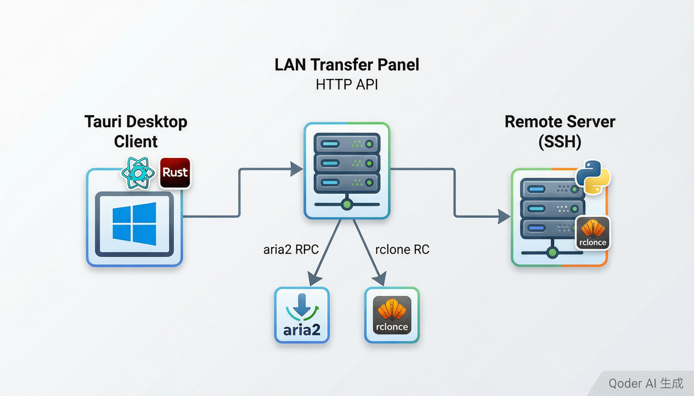
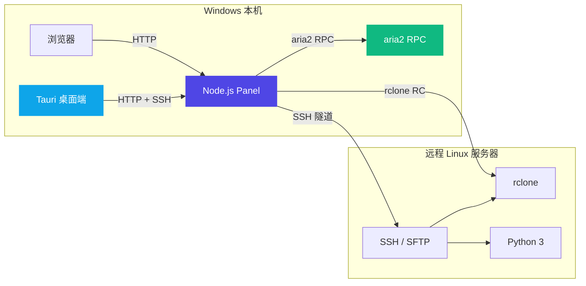
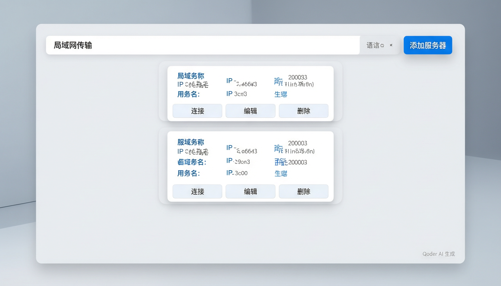
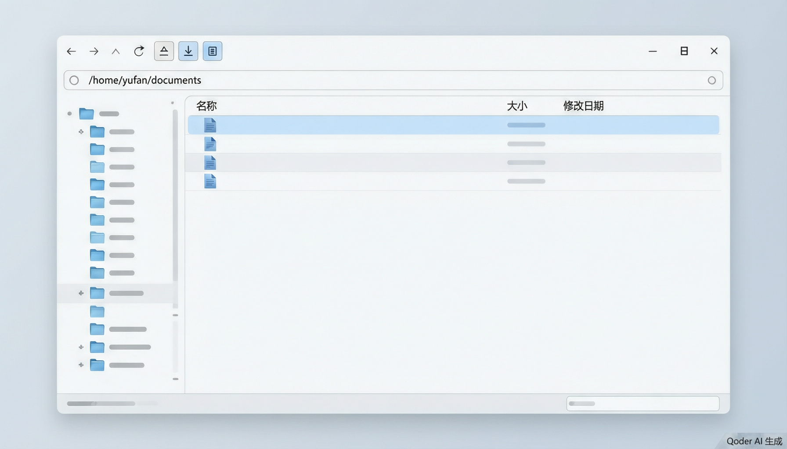
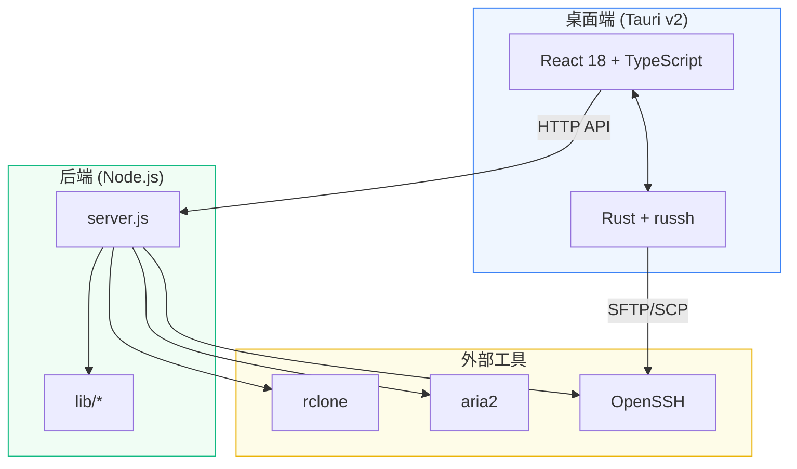
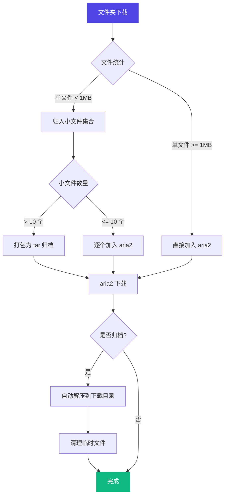

# LAN Transfer Panel

**局域网文件传输面板** — 基于 Node.js + Tauri 的局域网文件传输工具，整合 rclone、aria2 和 SSH，提供浏览器 UI 和 Windows 桌面客户端。


---

## 系统架构

<p align="center">
  
</p>



**核心思路：** Node.js 后端作为统一控制层，代理 rclone RC（远程存储）和 aria2 RPC（下载引擎），通过 SSH 隧道访问远程服务器。浏览器和桌面端都通过 HTTP API 与后端交互。

---

## 功能一览

| 功能 | 说明 |
|------|------|
| SSH 远程浏览 | SFTP 目录浏览、文件夹树导航、地址栏路径跳转 |
| 文件上传 | SFTP 多文件上传，保留目录结构 |
| 文件下载 | SFTP 单文件下载、SCP 文件夹递归下载 |
| aria2 队列 | URL 下载（HTTP/FTP/磁力链接）、暂停/继续/移除 |
| 服务器文件加入 aria2 | 远程文件通过 SSH 隧道提交本机 aria2 下载 |
| 文件夹下载策略 | 智能判断：小文件打 tar 包，大文件直接下载 |
| 分流发送 | 大文件走对端 aria2 拉取，小文件走 rclone copy / rsync |
| 多服务器管理 | 保存多组 SSH 连接配置，密码/密钥认证 |
| 虚拟拖拽 | Windows OLE 拖拽远程文件到资源管理器 |

---

## 桌面客户端

基于 **Tauri v2** 构建的原生 Windows 桌面应用，使用 React + TypeScript 前端和 Rust 后端。

### 服务器选择

<p align="center">
  
</p>

启动后显示服务器选择界面，支持多组 SSH 连接配置（密码或密钥认证），配置文件保存在 `%APPDATA%\LAN Transfer\ssh-profiles.json`。

### 文件浏览器

<p align="center">
  
</p>

连接后进入 Explorer 风格的文件浏览界面：左侧目录树、右侧文件列表、工具栏提供导航和操作按钮，底部状态栏显示项目统计。

---

## 技术栈



| 层 | 技术 | 说明 |
|----|------|------|
| 后端 | Node.js ≥ 20, ES Modules | 零 npm 依赖，仅使用 Node 核心模块 |
| 浏览器 UI | Vanilla JS + CSS | 无构建步骤，直接静态文件服务 |
| 桌面前端 | React 18, TypeScript, Zustand, Vite | 状态管理用 Zustand，图标用 lucide-react |
| 桌面后端 | Rust, Tauri v2 | SFTP 用 russh + russh-sftp，异步用 tokio |
| 测试 | Node test runner (后端), Vitest (桌面端) | `node:test` + `node:assert/strict` |

---

## 快速开始

### 前置条件

- **Node.js** ≥ 20
- **rclone**（可选，用于非 SSH 的 remote 存储）
- **aria2**（需运行 RPC 服务）
- **OpenSSH 客户端**（桌面端 SSH 连接）
- 远程服务器需安装 **Python 3**

### 后端服务

```bash
# 启动后端
npm start

# 或开发模式（同时启动后端和桌面端 Vite dev server）
npm run dev
```

默认监听地址：
- `http://127.0.0.1:5590/`
- `http://10.42.0.1:5590/`（局域网地址，可通过 `PANEL_BIND` 配置）

### 桌面客户端

```bash
# 安装依赖
npm install
npm install --prefix desktop

# 开发模式
npm run desktop:dev

# 构建安装包
npm run desktop:build
```

构建产物位于 `desktop/src-tauri/target/release/bundle/nsis/`。

---

## 配置

所有配置通过环境变量完成，支持 `.env` 文件：

| 变量 | 默认值 | 说明 |
|------|--------|------|
| `PANEL_BIND` | `127.0.0.1,10.42.0.1` | 监听地址，逗号分隔 |
| `PANEL_PORT` | `5590` | 监听端口 |
| `PANEL_USER` / `PANEL_PASS` | 复用 rclone 凭据 | 面板登录凭据 |
| `RCLONE_CREDENTIALS` | — | rclone 凭据文件路径 |
| `RCLONE_URL` | — | rclone RC 地址 |
| `ARIA2_CONF` | — | aria2 配置文件路径 |
| `ARIA2_URL` | — | aria2 RPC 地址 |
| `ARIA2_SECRET` | — | aria2 RPC 密钥 |
| `ARIA2_DIR` | — | aria2 下载目录 |
| `SSH_HOST` | `yufanssh` | SSH 主机别名 |
| `SSH_ROOT` | `/home/yufan` | SSH 文件浏览根目录 |
| `SSH_REMOTE_NAME` | `server` | 前端显示的服务器名称 |
| `PANEL_CORS_ORIGINS` | Vite/Tauri dev origins | CORS 允许的来源 |

---

## 文件下载策略

文件夹下载采用智能分流策略：



---

## 开发

### 项目结构

```
lan-transfer-panel/
├── server.js              # 后端入口（~1930 行，零依赖）
├── public/                # 浏览器 UI（vanilla JS/CSS）
├── lib/                   # 后端辅助模块
│   ├── aria2-download.js  # aria2 请求构建
│   ├── cors.js            # CORS 处理
│   ├── folder-plan.js     # 文件夹下载策略
│   ├── ssh-source.js      # SSH 隧道和 rclone serve
│   └── ...
├── test/                  # 后端单元测试
├── desktop/               # Tauri 桌面客户端
│   ├── src/               # React + TypeScript 前端
│   │   ├── api/           # HTTP 客户端
│   │   ├── features/      # 功能模块（auth, remote, local, queue）
│   │   ├── state/         # Zustand 状态管理
│   │   └── i18n/          # 国际化
│   └── src-tauri/         # Rust 后端
│       └── src/           # SFTP, 拖拽, 传输队列
└── docs/                  # 文档和设计稿
```

### 测试

```bash
# 后端测试
npm test

# 桌面端测试
npm run desktop:test

# Rust 编译检查
cargo check --manifest-path desktop/src-tauri/Cargo.toml
```

### 代码规范

- ES Modules，`type: "module"`
- JavaScript: 两空格缩进、分号、单引号、`const` 优先
- CSS: `kebab-case` 类名
- Rust: 标准 `cargo fmt` 格式
- UI 文案和错误消息以中文为主

---

## API 文档

完整的 HTTP API 文档见 [`docs/client-api.md`](docs/client-api.md)，包含认证、文件浏览、上传下载、aria2 队列控制和分流发送等接口说明。

---

## 安全设计

- Session cookie 使用 `HttpOnly; SameSite=Lax; Path=/`
- 密码比对使用 `crypto.timingSafeEqual`
- 路径遍历防护（远程路径 + SSH 路径）
- rclone serve 使用随机密码和 `0o600` 权限的 `.htpasswd`
- SSH 命令使用 `BatchMode=yes` 和 shell 转义参数
- 阻止根目录删除
- CORS 默认仅允许 Vite/Tauri 开发来源

---

## License

MIT
